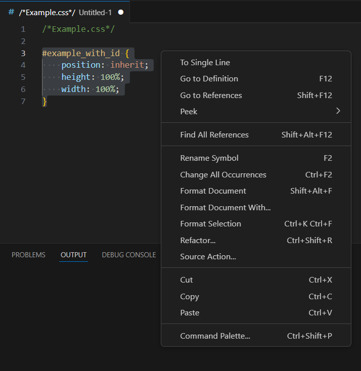

# SingleStyle
**Visual Studio Code extension that adds "To Single Line" to the right-click context menu**
### Usage
Select all CSS code you want to minify, then right click and select "To Single Line"
 